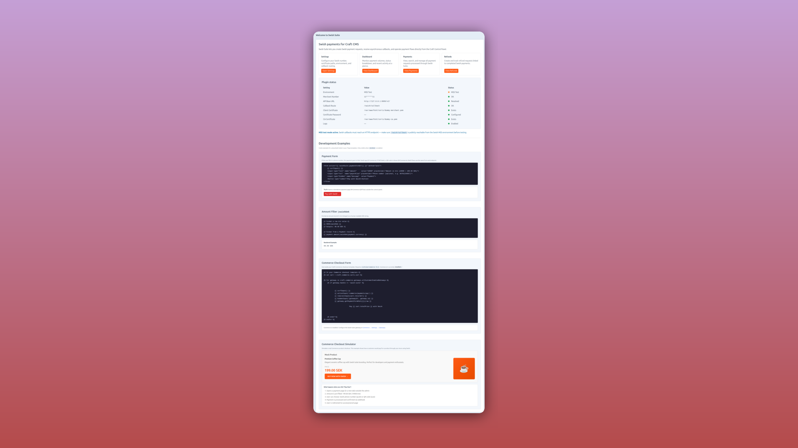
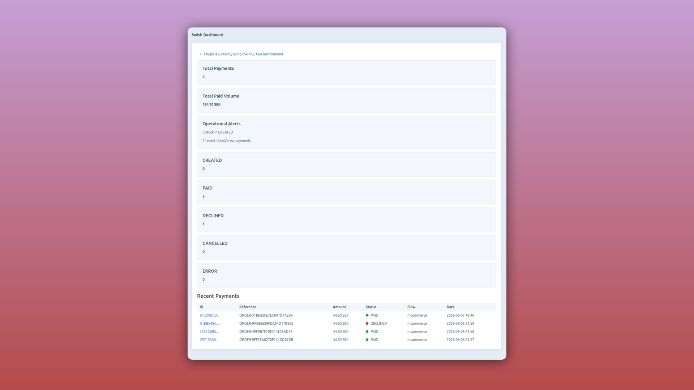
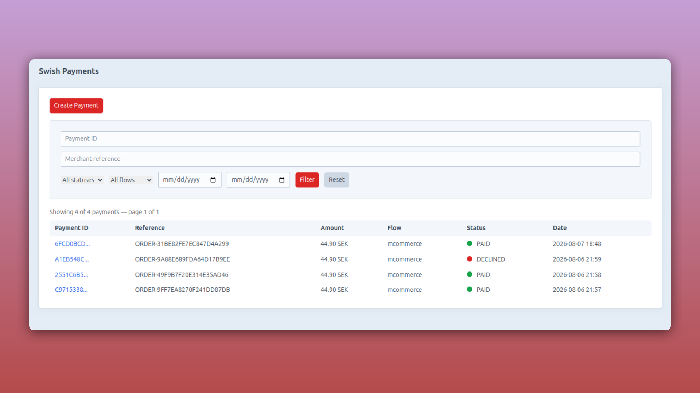
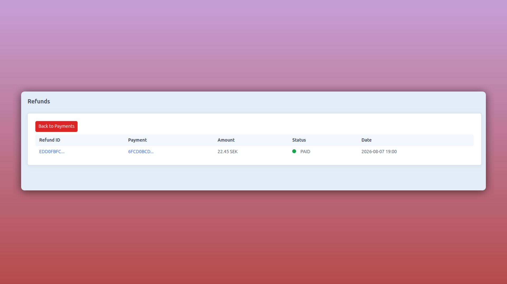

# Swish Suite

[](LICENSE)
[](https://craftcms.com)
[](https://www.php.net)

Professional Craft CMS 5 plugin for seamless Swish payment integration. Supports both E-Commerce and M-Commerce flows with asynchronous callback processing, comprehensive logging, and a full-featured Control Panel.

> **Swish** is Sweden's leading mobile payment service, enabling quick and secure payments via QR codes or push notifications.

## Features

- ✅ **Full Swish API Integration** — Payment requests, refunds, and status lookups
- ✅ **Flexible Payment Flows** — E-Commerce (push notification) and M-Commerce (QR code)
- ✅ **Craft Commerce Integration** — Works seamlessly as a payment gateway
- ✅ **Asynchronous Processing** — Queue-based callback handling prevents timeouts
- ✅ **Control Panel Dashboard** — Monitor payments, manage refunds, and diagnose issues
- ✅ **Environment Configuration** — Secure certificate and credential management
- ✅ **Structured Logging** — Async file logging with audit trails
- ✅ **Partial Refunds** — Full and partial refund support with Swish API validation
- ✅ **Security-First** — HMAC callback validation and HTTPS enforcement

## Table of Contents

- [Requirements](#requirements)
- [Installation](#installation)
- [Configuration](#configuration)
- [Environment Variables](#environment-variables)
- [Payment Flow](#payment-flow)
- [Craft Commerce Integration](#craft-commerce-integration)
- [Control Panel](#control-panel)
- [Refunds](#refunds)
- [Callbacks and Security](#callbacks-and-security)
- [Troubleshooting](#troubleshooting)
- [Development](#development)
- [License](#license)

## Requirements

### Software
- **PHP** 8.1+ (same as your Craft CMS 5 installation)
- **Craft CMS** 5.0+
- **Craft Commerce** 5.0+ (required for gateway integration)

### Swish Credentials
Before installing this plugin, you'll need:
- **Merchant Swish Number** (e.g., `1234679304`)
- **Client Certificate** (`.p12` file provided by Swish)
- **Certificate Password** (provided by Swish)
- **CA Certificate** (`Swish_TLS_RootCA.pem` — downloadable from Swish)

> 📌 **Tip:** Request your credentials from [Swish Integration Support](https://www.swish.nu/en/get-swish)

## Installation

### Step 1: Install via Composer

```bash
composer require 99x/craft-swish-suite
```

### Step 2: Enable in Craft Control Panel

1. Log in to the **Craft Control Panel**
2. Navigate to **Settings → Plugins**
3. Find **Swish Suite** and click **Install**

The plugin will automatically create required database tables.

### Step 3: Configure Credentials

1. Go to **Settings → Swish Suite**
2. Enter your Swish merchant credentials:
   - Merchant Swish Number
   - Certificate Path
   - Certificate Password
   - CA Certificate Path
3. Choose **Test Mode** for development, disable for production
4. Click **Save**

> 💡 **Security Tip:** Use environment variables for sensitive credentials (see [Environment Variables](#environment-variables) below)

### Local Development with Path Repository

If you're developing the plugin locally:

```json
{
  "repositories": [
    {
      "type": "path",
      "url": "../swish-payment-plugin/craft-swish-suite"
    }
  ],
  "require": {
    "99x/craft-swish-suite": "@dev"
  }
}
```

Then run:
```bash
composer update 99x/craft-swish-suite
```

## Configuration

Configuration is managed in the Control Panel at **Settings → Swish Suite**.

### Configuration Fields

| Field | Required | Description |
|-------|----------|-------------|
| **Swish Number** | ✅ | Your 10-digit merchant Swish number (e.g., `1234679304`) |
| **Certificate Path** | ✅ | Absolute path to your `.p12` client certificate |
| **Certificate Password** | ✅ | Password protecting your certificate |
| **CA Path** | ✅ | Path to Swish root CA certificate (`Swish_TLS_RootCA.pem`) |
| **Success URL** | ❌ | Redirect after successful payment (default: `/`) |
| **Cancel URL** | ❌ | Redirect after cancelled payment (default: `/shop/cart`) |
| **Checkout Title** | ❌ | Payment method name in checkout (default: `Pay with Swish`) |
| **Test Mode** | ❌ | Use Swish MSS test environment (default: enabled) |
| **Enable Logs** | ❌ | Enable async logging for debugging (default: enabled) |

### Using Environment Variables

For security and environment-specific configuration, use environment variable aliases:

```text
$SWISH_NUMBER
$SWISH_CERT_PATH
$SWISH_CERT_PASSWORD
$SWISH_CA_PATH
```

Example in CP field:
```
$SWISH_CERT_PATH
```

This will load the value from your `.env` file automatically.

## Environment Variables

All credentials and configuration can be managed via environment variables — recommended for security and multi-environment deployments.

### Required Variables

| Variable | Purpose | Example |
|----------|---------|---------|
| `SWISH_NUMBER` | Merchant Swish number | `1234679304` |
| `SWISH_CERT_PATH` | Path to `.p12` certificate | `/var/www/certs/merchant.p12` |
| `SWISH_CERT_PASSWORD` | Certificate password | `your-secure-password` |
| `SWISH_CA_PATH` | Path to CA certificate | `/var/www/certs/Swish_TLS_RootCA.pem` |

### Optional Variables

| Variable | Purpose | Default |
|----------|---------|---------|
| `SWISH_BASE_URL` | Custom API endpoint | Automatic (test or prod) |
| `SWISH_CALLBACK_URI` | Public callback route | `/swish/callback` |

### Example `.env` Configuration

```dotenv
# Swish Integration
SWISH_NUMBER=1234679304
SWISH_CERT_PATH=/var/www/certs/swish-merchant.p12
SWISH_CERT_PASSWORD=your-secure-password-here
SWISH_CA_PATH=/var/www/certs/Swish_TLS_RootCA.pem

# Optional: Override API endpoint for testing
SWISH_BASE_URL=https://mss.cpc.getswish.net/swish-cpcapi/api/v2

# Optional: Custom callback route
SWISH_CALLBACK_URI=/payments/swish-callback
```

### Critical: Callback URL Configuration

The callback endpoint must be:
- ✅ **Publicly accessible** over HTTPS
- ✅ **Reachable from Swish servers** (not localhost)
- ✅ **Properly configured** with Swish or using ngrok tunneling

#### Local Development Setup

For testing locally, use **ngrok** to expose your server:

```bash
# Terminal 1: Start ngrok tunnel
ngrok http 80

# Terminal 2: Copy the HTTPS URL and use in .env
# Example: https://abc123.ngrok.io
SWISH_CALLBACK_URI=/swish/callback
```

> ⚠️ **Important:** If the callback URL is unreachable, payments will remain in `CREATED` status indefinitely and never confirm.

## Payment Flow

The plugin supports two payment flows depending on whether a Swish phone number is provided:

### E-Commerce Flow (with Swish Phone Number)

Optimized for online purchases with immediate push notification:

```
User enters phone → Payment request created → Push notification sent
→ User confirms in Swish app → Callback received → Order confirmed
```

**Advantages:**
- Fast payment confirmation (no QR scan needed)
- Better user experience
- Real-time payment status updates

### M-Commerce Flow (without Phone Number)

QR-based payments for in-store or mobile scenarios:

```
Payment request created → QR code displayed → User scans with Swish app
→ User confirms → Callback received → Order confirmed
```

**Advantages:**
- No phone number needed
- Works for POS systems
- Flexible payment options

### Transaction Lifecycle

1. **Payment Request** — Plugin calls Swish API, stores payment record locally
2. **Awaiting Confirmation** — User approves in Swish app (push or QR)
3. **Callback Received** — Swish posts payment status to `/swish/callback`
4. **Status Updated** — Plugin updates payment record and creates Commerce transaction
5. **Order Confirmed** — Customer notified, order processing begins

## Routes

The plugin registers the following routes:

| Route | Method | Purpose |
|-------|--------|---------|
| `/swish/checkout` | GET | Payment waiting screen |
| `/swish/payments/process` | POST | Process payment (Commerce integration) |
| `/swish/payments/success` | GET | Success redirect page |
| `/swish/payments/cancel` | GET | Cancellation page |
| `/swish/callback` | POST | Async payment status callback (configurable) |

**Note:** The callback route is configurable via `SWISH_CALLBACK_URI` environment variable.

## Craft Commerce Integration

Swish Suite seamlessly integrates with **Craft Commerce 5** as a payment gateway.

### Setting Up the Gateway

1. Navigate to **Commerce → Settings → Gateways**
2. Click **New Gateway**
3. Select **Swish Suite** as the gateway type
4. Enter a display name (e.g., "Swish Mobile Payment")
5. The handle is automatically set to `swish-suite`
6. Configure address conditions if needed
7. Save

The gateway automatically inherits merchant number, certificates, and test mode settings from the plugin configuration.

### Checkout Template Example

```twig
{# In your Craft Commerce checkout template #}


<form method="post">
  {{ csrfInput() }}
  {{ actionInput('commerce/payments/pay') }}
  
  
    
      <div class="payment-method">
        <h3>Pay with Swish</h3>
        
        {# Render the payment form (asks for optional phone number) #}
        {{ gateway.getPaymentFormHtml({}) | raw }}
        
        <input type="hidden" name="gatewayId" value="{{ gateway.id }}">
        <input type="hidden" name="redirect" value="{{ cart.returnUrl }}">
        
        <button type="submit" class="btn btn-primary">
          Pay {{ cart.totalPrice | commerceCurrency(cart.paymentCurrency) }} with Swish
        </button>
      </div>
    
  
</form>
```

### Payment Form Behavior

The Swish payment form includes:
- **Optional Swish Phone Number** — Field for user to enter their Swish-linked phone number
- **E-Commerce vs M-Commerce** — Form automatically selects the right flow:
  - Phone provided → E-Commerce (push notification)
  - No phone → M-Commerce (QR code display)

### Transaction Status Updates

The order payment status is updated **asynchronously via callback**, not when users return to your site:

| Status | Meaning |
|--------|---------|
| **Processing** | Payment request created, awaiting confirmation |
| **Paid** | Swish callback confirmed payment success |
| **Failed** | Swish callback reported payment declined or error |

> 💡 **Note:** Always rely on Swish callbacks for payment confirmation, never on page redirects.

## Control Panel

The plugin adds a **Swish Suite** section to the Craft Control Panel with five main areas:

### Welcome
Quick-start guide and status overview for new installations.



### Diagnostics
Configuration troubleshooting and health checks:
- Verifies certificate paths are readable
- Validates Swish API connectivity
- Tests callback endpoint reachability
- Confirms environment variables are set correctly

### Dashboard
Operational overview of payment activity:
- Total payments, revenue, and success rate
- Recent payments with status indicators
- Payment state distribution (created, paid, failed)
- Quick filters by date range



### Payments
Complete payment history and management:
- Search and filter by payment ID, status, amount, or date
- Pagination and sortable columns
- Manual status refresh (lookup from Swish API)
- Payment details, response payload, and audit logs
- Export functionality for reports



### Refunds
Manage refunds for completed payments:
- List all refunds with status tracking
- Create new refunds (full or partial)
- Refund validation and balance checks
- Audit trail and response logs



All screens feature **real-time status updates** and detailed logging for troubleshooting.

## Callbacks and Security

### Callback Validation

The callback endpoint (`/swish/callback`) implements multiple security layers:

✅ **HMAC Validation** — Every callback signature is validated against stored `callbackIdentifier`
✅ **HTTPS Only** — Enforced for production environments
✅ **CSRF Exemption** — Required for payment gateway callbacks
✅ **Anonymous Access** — Allows Swish infrastructure to post without authentication
✅ **Request Logging** — Full body and headers logged for audit trails

### Callback Processing

1. Incoming callback is validated with `callbackIdentifier` (HMAC-like comparison)
2. Request body and headers are logged
3. Processing is **queued asynchronously** to prevent timeouts
4. Payment record is updated with Swish response
5. Commerce transaction is created if payment confirmed (PAID status)
6. Event is triggered for custom handling if needed

### Invalid Callbacks

Invalid or inconsistent callbacks are:
- Logged with full details for debugging
- **Always** responded to with `HTTP 200` to prevent Swish retry storms
- Never processed or used to update payment status

### Logging

All callbacks are logged with:
- Timestamp and IP address
- Request body (payment/refund details)
- Response headers and validation results
- Processing status and errors

Logs are available in **Swish Suite → Payments** or in the file system at `storage/logs/swish-suite-YYYY-MM-DD.log`.

## Refunds

The plugin supports **full and partial refunds** through the Swish API with full Craft Commerce integration.

### Refund Rules

Before creating a refund, the plugin verifies:

- ✅ Original payment exists and has status `PAID`
- ✅ Payment has a valid `paymentReference` from Swish
- ✅ Refund amount doesn't exceed available balance (original amount minus prior refunds)
- ✅ Refund amount is positive and properly formatted

### Issuing a Refund

#### Via Craft Commerce

1. Go to **Orders → [Order] → Transactions**
2. Click **Refund** on the successful payment transaction
3. Enter refund amount (or leave blank for full refund)
4. Confirm

The gateway will:
1. Validate the original payment and available balance
2. Send refund request to Swish API
3. Create a child refund transaction in Commerce (initial status: Processing)
4. Wait for Swish callback to confirm refund status

#### Via Swish Suite Control Panel

1. Go to **Swish Suite → Refunds**
2. Click **New Refund**
3. Select the payment and enter refund amount
4. Confirm

### Refund Status

Refunds progress through these statuses, updated via Swish callbacks:

| Status | Meaning |
|--------|---------|
| `CREATED` | Refund request sent to Swish, awaiting confirmation |
| `PAID` | Refund successfully processed by Swish |
| `DECLINED` | Swish rejected the refund (insufficient balance, expired, etc.) |
| `ERROR` | Processing error (invalid reference, API error, etc.) |

### Refund Limits

- **Per transaction:** Cannot exceed the original payment amount
- **Partial refunds:** Full support via Swish API
- **Multiple refunds:** Can issue multiple partial refunds for the same payment
- **Refund timeline:** Typically processes within 1-2 business days

Monitor refund status in **Swish Suite → Refunds** or check the payment details in **Swish Suite → Payments**.

## Logging and Debugging

### Enable Logging

1. Go to **Settings → Swish Suite**
2. Enable **Enable Logs** toggle
3. Save settings

### View Logs

Logs are written to: `storage/logs/swish-suite-YYYY-MM-DD.log`

Each log entry includes:
- Timestamp
- Log level (INFO, WARNING, ERROR)
- Event (payment callback, refund, API call, etc.)
- Payment or refund ID
- Error message (if applicable)

### Diagnostic Screen

Access **Swish Suite → Diagnostics** to check:
- ✅ Certificate files readable and valid
- ✅ Swish API endpoint reachable
- ✅ Callback URL publicly accessible
- ✅ Environment variables configured
- ✅ Database tables created

## Troubleshooting

### Payment stuck in "Created" status

**Symptom:** Payment was submitted but status never updates to PAID or DECLINED.

**Causes & Solutions:**
- **Callback URL unreachable** — Verify callback URL is public HTTPS (use ngrok if testing locally)
- **Firewall blocking requests** — Check firewall/WAF rules allow POST from Swish IPs
- **Wrong callback URI** — Verify `SWISH_CALLBACK_URI` matches Swish configuration
- **Log rotation issue** — Check `storage/logs/` for errors and recent activity

**How to check:**
1. Go to **Swish Suite → Diagnostics** and verify callback reachability
2. Check logs for callback attempts: `tail -f storage/logs/swish-suite-*.log`
3. Manually trigger status update: **Swish Suite → Payments** → Click payment → **Refresh Status**

### "Certificate not found or not readable"

**Symptom:** Error message in diagnostics or payment attempt fails.

**Solution:**
1. Verify certificate file path exists: `ls -la /path/to/cert.p12`
2. Check file permissions: `chmod 644 /path/to/cert.p12`
3. Use absolute paths (not relative paths)
4. Test with local path first, then environment variable

**Example:**
```bash
# Good
/var/www/certs/swish-merchant.p12

# Bad (relative)
./certs/swish-merchant.p12
./certs/merchant.p12
```

### Invalid callback identifier

**Symptom:** Logs show "Callback validation failed" but payment is from Swish.

**Causes:**
- Database corrupted or payment record deleted
- Multiple plugins processing the same callback
- Callback processed twice simultaneously

**Solution:**
1. Check **Swish Suite → Payments** — is the payment record there?
2. Verify `callbackIdentifier` column exists and has a value
3. Check database integrity: `php craft db/migrate --track=false`
4. Contact Swish support with payment ID and timestamp

### "Test Mode" vs Production

**Symptom:** Payments work in test mode but not in production.

**Solution:**
1. Go to **Settings → Swish Suite**
2. **Disable** "Test Mode" for production
3. Update certificates for production (different from test certificates)
4. Update Swish Number for production account (different from test)
5. Clear any cached settings: `php craft cache/flush-all`

### Refund amount exceeds available balance

**Symptom:** Cannot issue refund even for full payment amount.

**Causes:**
- Prior partial refunds reduced available balance
- Payment was already partially refunded
- Currency conversion issues (öre vs SEK)

**Solution:**
Check **Swish Suite → Payments** → Payment details to see:
- Original payment amount (in öre)
- All refunds issued (sum of refund amounts)
- Available balance for new refunds

## Architecture

### Directory Structure

```text
src/
  controllers/              # Frontend and Commerce controllers
  controllers/cp/           # Control Panel controllers
  migrations/               # Database migrations
  models/                   # Settings and form models
  queue/jobs/               # Async job queue handlers
  records/                  # Database models (Payment, Refund)
  services/                 # Core services (Swish API, callbacks, helpers)
  templates/                # Twig templates for CP and frontend
  twig/                     # Custom Twig filters and extensions
  enums/                    # Status enums (PaymentStatus, RefundStatus)
  events/                   # Custom events for plugins to hook into
  gateways/                 # Craft Commerce gateway implementation
```

### Key Services

- **SwishPaymentService** — Handles API calls to Swish (payments, refunds, status lookups)
- **CallbackHandlerService** — Processes async payment/refund callbacks
- **HelperFunctionService** — Logging and utility functions

## Development

### Setup

```bash
# Clone the repository
git clone https://github.com/99x/craft-swish-suite.git
cd craft-swish-suite

# Install dependencies
composer install

# Run tests
composer test
```

### Running Tests

```bash
# Run all tests (CS check + PHPStan)
composer test

# Check code style (ECS)
composer check-cs

# Fix code style
composer fix-cs

# Run PHPStan analysis
composer phpstan

# Run PHPUnit tests
composer unit
```

### Code Quality Tools

- **PHPStan** — Static analysis for type errors
- **ECS** — Standardized code formatting
- **PHPUnit** — Unit tests

### Making a Pull Request

1. Create a feature branch: `git checkout -b feature/my-feature`
2. Make your changes
3. Run tests locally: `composer test`
4. Commit with clear messages
5. Push and open a pull request

## Security Considerations

### Best Practices

- ✅ Always use HTTPS for callback URL (enforced in production)
- ✅ Store certificates outside webroot
- ✅ Use environment variables for sensitive credentials (not in .php files)
- ✅ Enable plugin logging for audit trails
- ✅ Run `php craft cache/flush-all` after updating credentials
- ✅ Monitor logs for suspicious activity

### Sensitive Data

The plugin **never stores**:
- ❌ Certificate contents in database
- ❌ Certificate passwords in logs
- ❌ Credit card information (Swish doesn't transmit this)

The plugin **does store** (encrypted in database):
- ✅ Payment amounts
- ✅ Payer phone numbers (if provided)
- ✅ Payment status and references
- ✅ Full Swish API responses (for auditing)

## License

MIT License — See LICENSE file for details.

---

**Made with ❤️ by [99x](https://99x.se)**

For support, issues, or questions, please open an issue on GitHub.

